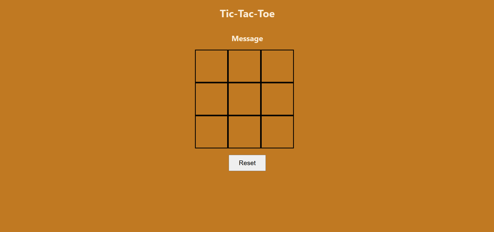

# Tic Tac Toe(XO)

## technologies used

1. html
2. css
3. javascript

## Description
this is calssix XO game.each person gets 1 turn. f you get 3 square of the same value you win

## User Stories

1. AS a User, I want to see a 3x3 grid board

2. as a User,I want to click on a square to place my X or O

3. as a user , I want to see if I win if I get 3 Xs in a row 

4. as a User, I want see a tie message if no player win

5. as a User, I want see restart button when i click it the game should reset

## ScreenShots

